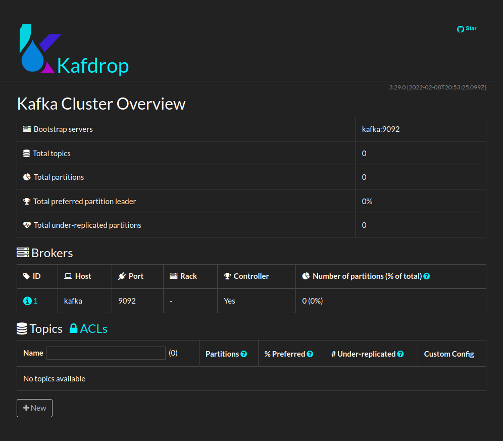

# Kafka Zookeeper Kafdrop
Kafka, Zookeeper and Kafdrop with a simple `docker-compose up`.

Single node Kafka, Zookeeper and Kafdrop - ideal for quickly bootstrapping your development machine.

## Usage
Start the services with `docker-compose up`.

Kafka ist available under localhost:9092. 

If you are developing with Spring Boot, add this to your application.yml:
```yaml
spring:
  kafka:
    bootstrap-servers: localhost:9092
```

Kafrop is available under [localhost:9000](http://localhost:9000)


